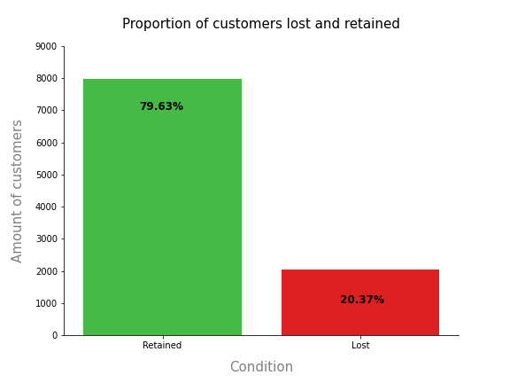
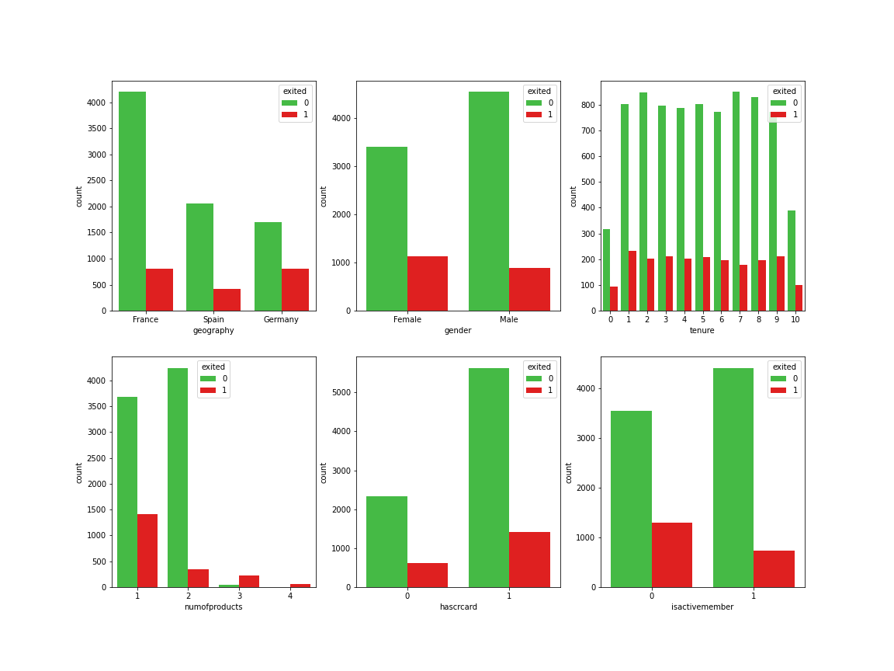
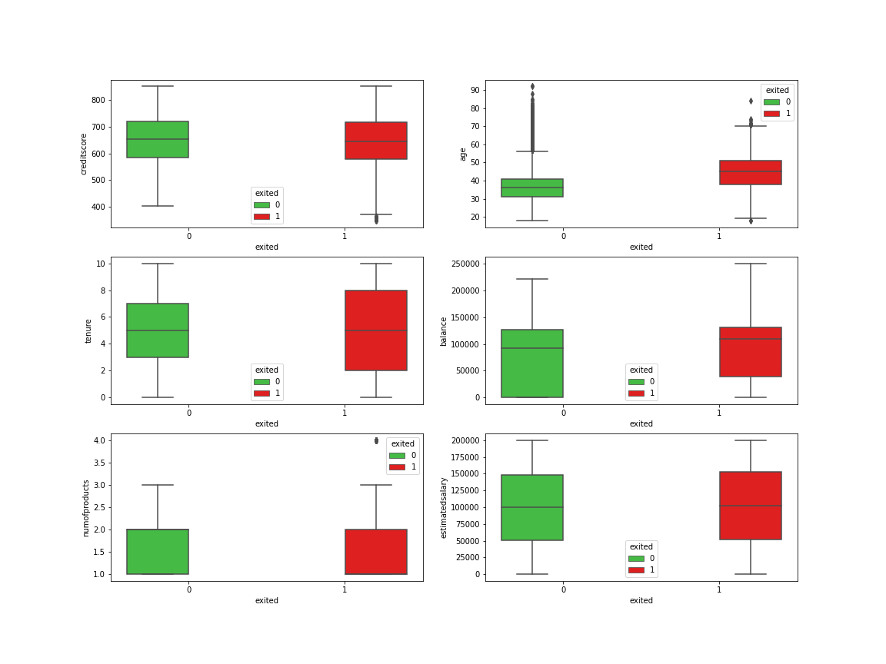
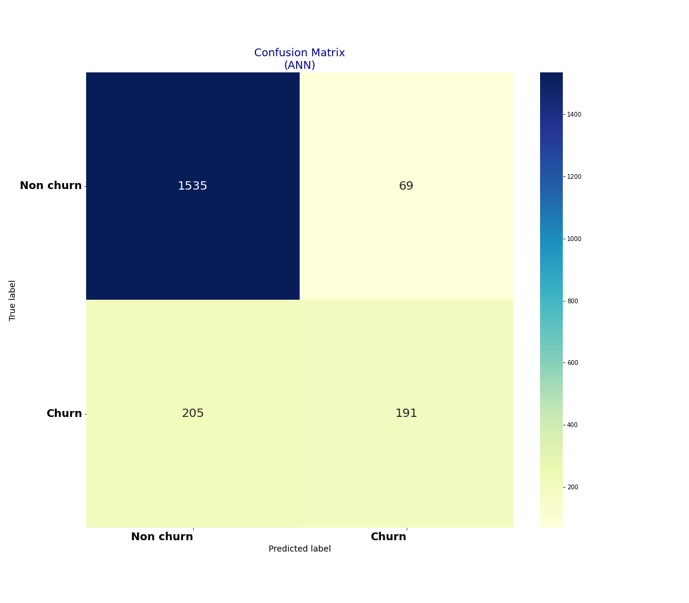

# 🏦 Bank Churn Analysis 2: Project Overview
* End to end project reasearching the effects personal attributes have on the diagnosis of diabetes.
* Optimised XGBoost using GridsearchCV  to reach the best model. 
* Built a stakeholder facing visual deployment of model to predict churn of new customers 
* Deployed Model in Power BI for Business Intelligence analysis 
* An artificial neural network (ANN) is a type of machine learning algorithm that is similar to the brain.

[View prerequisite of this project](https://github.com/MattithyahuData/P2-Bank-churn-prediction)

[View Deployed Model in Power BI](https://app.powerbi.com/view?r=eyJrIjoiNDExYjQ0OTUtNWI5MC00OTQ5LWFlYmUtYjNkMzE1YzE2NmE0IiwidCI6IjYyZWE3MDM0LWI2ZGUtNDllZS1iZTE1LWNhZThlOWFiYzdjNiJ9&pageName=ReportSection)

## Table of Contents 
[Resources](#resources)<br>
[Data Collection](#DataCollection)<br>
[Data Pre-processing](#DataPre-processing)<br>
[Data Warehousing](#DataWarehousing)<br>
[Exploratory data analysis](#EDA)<br>
[Data Visualisation & Analytics](#Dataviz)<br>
[Business Intelligence](#Busintelli)<br>
[Feature Engineering](#FeatEng)<br>
[ML/DL Model Building](#ModelBuild)<br>
[Model performance](#ModelPerf)<br>
[Model Optimisation](#ModelOpt)<br>
[Model Evaluation](#ModelEval)<br>
[Deployment](#ModelDeploy)<br>
[Project Management (Agile | Scrum)](#Prjmanage)<br>
[Project Evaluation](#PrjEval)<br>
[Looking Ahead](#Lookahead)<br>
[Questions | Contact me ](#Lookahead)<br>


<a name="Resources"></a>  

## Resources Used
**Python 3, PostgreSQL, PowerBI** 

[**Anaconda Packages:**](requirements.txt) **pandas numpy pandas_profiling ipywidgets sklearn matplotlib seaborn sqlalchemy tensorflow keras kaggle psycopg2 ipykernel**<br><br>
Powershell command for installing anaconda packages used for this project    
```powershell
pip install pandas numpy pandas_profiling ipywidgets sklearn matplotlib seaborn sqlalchemy tensorflow keras kaggle psycopg2 ipykernel
```

<a name="DataCollection"></a>  

## [Data Collection](Code/P6_Code.ipynb)
Powershell command for data import using kaggle API <br>
```powershell
!kaggle datasets download -d kmalit/bank-customer-churn-prediction -p ..\Data --unzip 
```
[Data source link](https://www.kaggle.com/kmalit/bank-customer-churn-prediction)
[Data](Data/Churn_Modelling.csv)
*  Rows: 10000 | Columns: 14
    *   RowNumber
    *   CustomerId  
    *   Surname 
    *   CreditScore
    *   Geography
    *   Gender
    *   Age
    *   Tenure
    *   Balance
    *   NumOfProducts
    *   HasCrCard
    *   IsActiveMember
    *   EstimatedSalary
    *   Exited                   

<a name="DataPre-processing"></a>  

## [Data Pre-processing](Code/P6_Code.ipynb)
After I had all the data I needed, I needed to check it was ready for exploration and later modelling. I made the following changes and created the following variables:   
*   General NULL and data validity checks  

<a name="DataWarehousing"></a>

## [Data Warehousing](Code/P6_Code.ipynb)
I warehouse all data in a Postgre database for later use and reference.

*   ETL in python to PostgreSQL Database.
*   Formatted column headers to SQL compatibility. 

<a name="EDA"></a>  

## [Exploratory data analysis](Code/P6_Code.ipynb) 
I looked at the distributions of the data and the value counts for the various categorical variables that would be fed into the model. Below are a few highlights from the analysis.
*   79.63% of customers have churned - Distribution of features and their effects on churning - Some features have outliers, visualising this allows for greater clarity on the extent. 




*   I looked at the correlation the features have


<a name="Dataviz"></a>  

## [Data Visualisation & Analytics](https://app.powerbi.com/view?r=eyJrIjoiNDExYjQ0OTUtNWI5MC00OTQ5LWFlYmUtYjNkMzE1YzE2NmE0IiwidCI6IjYyZWE3MDM0LWI2ZGUtNDllZS1iZTE1LWNhZThlOWFiYzdjNiJ9&pageName=ReportSection)
[View Interactive Dashboard](https://app.powerbi.com/view?r=eyJrIjoiNDExYjQ0OTUtNWI5MC00OTQ5LWFlYmUtYjNkMzE1YzE2NmE0IiwidCI6IjYyZWE3MDM0LWI2ZGUtNDllZS1iZTE1LWNhZThlOWFiYzdjNiJ9&pageName=ReportSection)
*   I created an interactive dashboard to deploy the machine learning model to benefit the business.
*   I visualised various key features and highlighted their overall correlation to a customer’s churn. 

<a name="Busintelli"></a>  

## Business Intelligence
On Page 2 of the interactive dashboard, I have provided the stake holders with the new customer names and the customers that are likely to churn due to their characteristics.

*   These customers can be offered subsidised deals and incentives to keep them on
*   Greater engagement with customers could keep some customers on board 
*   Providing quality customer service can also provide customers with long term value and appreciation for the business
*   The complaints team should pay particular attention to complaints from customers who are predicted to churn.
- 96% of unhappy customers don’t complain and 91% of those will simply leave and never come back?

<a name="FeatEng"></a>  

## [Feature Engineering](Code/P6_Code.ipynb) 
I transformed the categorical variable(s) 'geography' and 'gender' into dummy variables. I also split the data into train and tests sets with a test size of 20%.
*   One Hot encoding to encode values
*   Using RobustScaler to scale  

<a name="ModelBuild"></a> 

## [ML/DL Model Building](Code/P6_Code.ipynb)

I used an Artificial Neural Network to attempt to improve the predictive performance for the churn project. ANNs have some key advantages that make them most suitable for certain problems and situations:
*   ANNs have the ability to learn and model non-linear and complex relationships, which is really important because in real-life, many of the relationships between inputs and outputs are non-linear as well as complex
*   Neural Networks have the ability to learn by themselves and produce the output that is not limited to the input provided to them.

<!--  -->

<a name="ModelPerf"></a> 

## [Model performance](Code/P6_Code.ipynb)
*   **Artificial Neural Network** : Accuracy = 84.45% 

<a name="ModelOpt"></a> 

## [Model Optimisation](Code/P6_Code.ipynb)
In this step, I used GridsearchCV to find the best parameters to optimise the performance of the model. (* Unless you have an extremely powrful computer using GridsearchCV with a large number of epochs will take a lot of time.)
Using the best parameters, I improved the model accuracy by **1%**

*   **Artificial Neural Network** : Accuracy = 85.45%  


<a name="ModelEval"></a> 

## [Model Evaluation](Code/P6_Code.ipynb)
*   A confusion matrix showing the accuracy score of 84.45% achieved by the model. 


<!-- <a name="ModelProd"></a> 

## [Model Productionisation](Code/P6_Code.ipynb)
*   A confusion matrix showing the accuracy score of 97.25% achieved by the model. 
 -->

<a name="ModelDeploy"></a> 

## [Deployment](https://app.powerbi.com/view?r=eyJrIjoiNDExYjQ0OTUtNWI5MC00OTQ5LWFlYmUtYjNkMzE1YzE2NmE0IiwidCI6IjYyZWE3MDM0LWI2ZGUtNDllZS1iZTE1LWNhZThlOWFiYzdjNiJ9&pageName=ReportSection)
I deployed the previous model in Microsoft Power BI for business intellignece use. 
*   I exported the model as a .pkl file and applied it to the unseen data set to get churn predictions and probability predictions.
*   I visualised this in Power BI and using conditional formatting to highlight those new customer sthat are more likely to curn based on the models prediction. 

<a name="Prjmanage"></a> 

## [Project Management (Agile | Scrum)](https://www.atlassian.com/software/jira)
* Resources used
    * Jira
    * Confluence
    * Trello 

<a name="PrjEval"></a> 

## [Project Evaluation]() 
*   WWW
    *   The end-to-end process
    *   Use of ANN in project
*   EBI 
    *   Better project management and planning would have made this project faster
    *   Time the coe took to run 

<a name="Lookahead"></a> 

## Looking Ahead
*   What next
*   Business application and better steps to preserve customer that are likely to churn

<a name="Questions"></a> 

## Questions | Contact me 
For questions, feedback, and contribution requests contact me
* ### [Click here to email me](mailto:theanalyticsolutions@gmail.com) 
* ### [See more projects here](https://github.com/MattithyahuData?tab=repositories)

